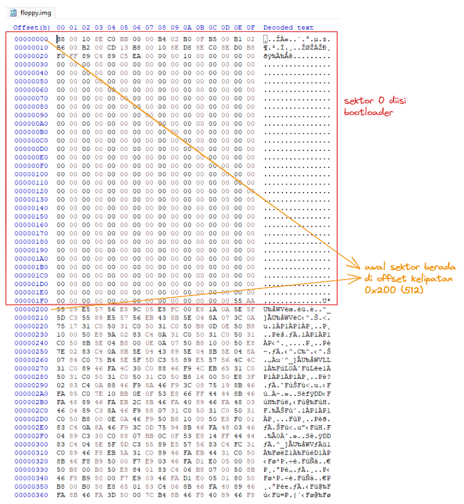
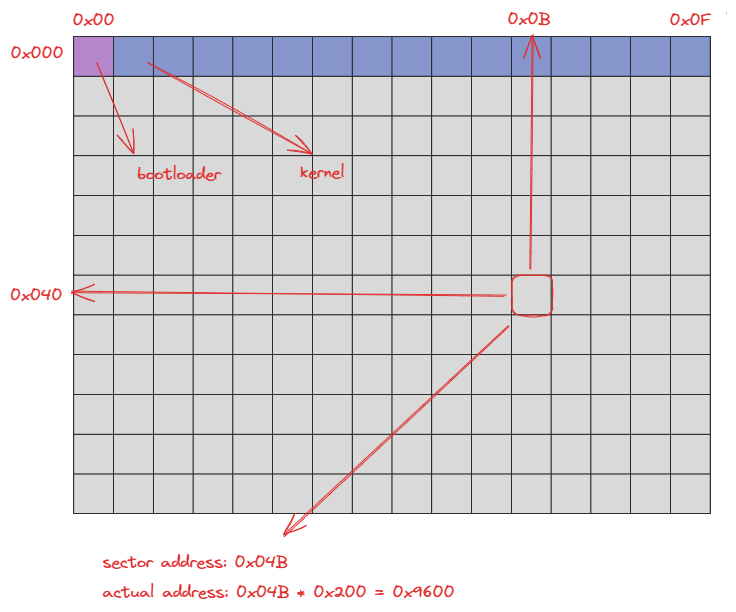
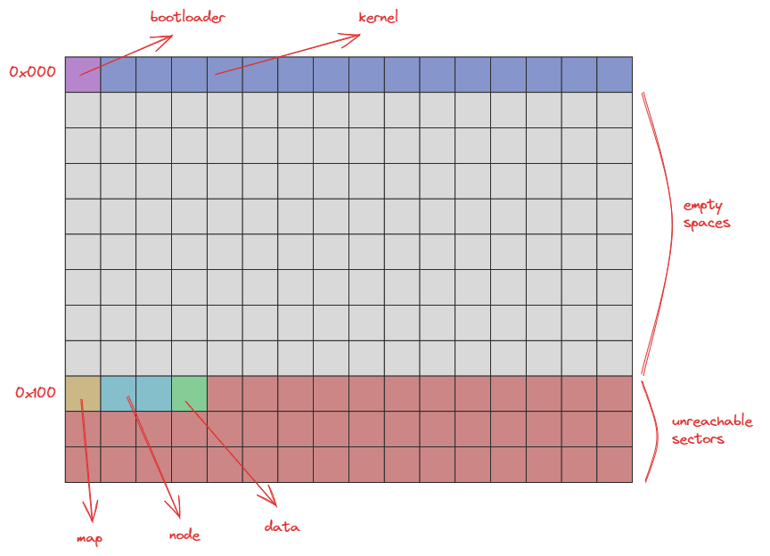
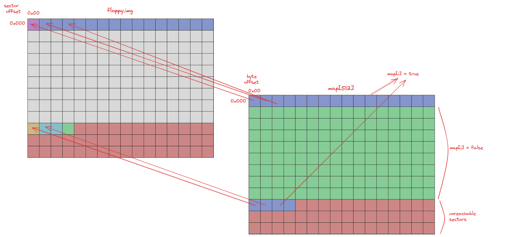
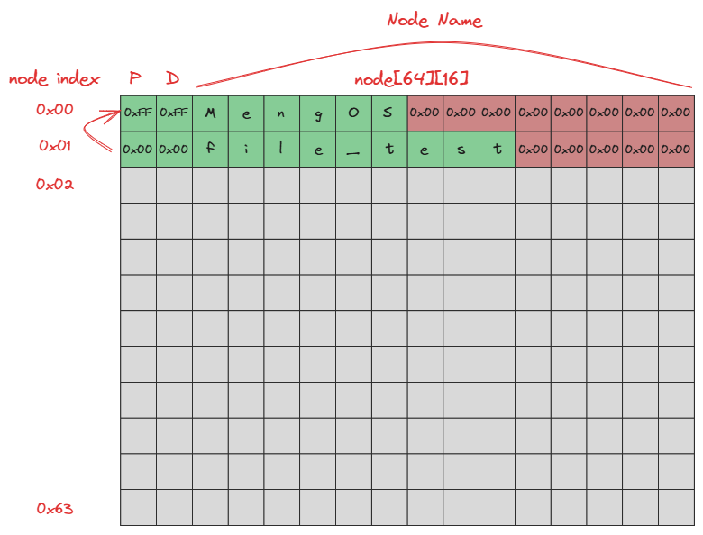
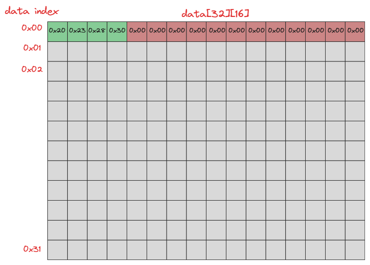
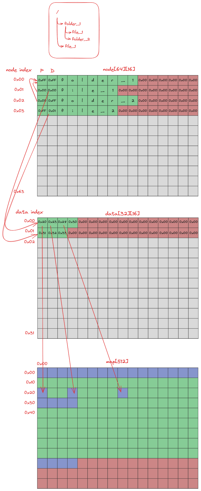
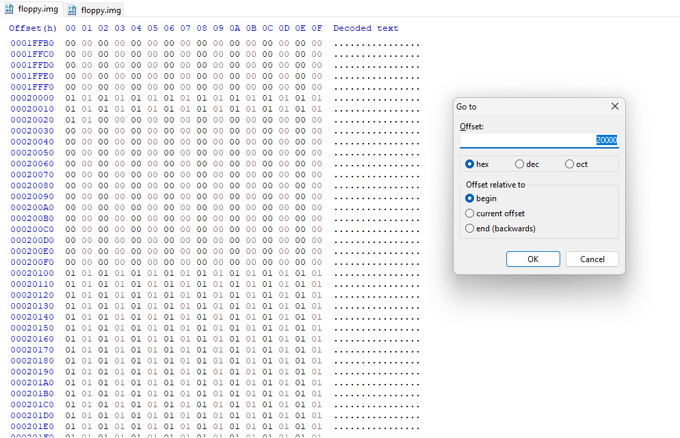

# MengOS

What??? Another OS???? :((

## Introduction

In the final practicum, we will continue `task-4` from the previous module 4 practicum. This time, we will create a simple filesystem that can be used to store the files we create. The filesystem that we will create will use a simple data storage method, which is by storing file data into blocks provided by the filesystem. If you can't wait to start working on the tasks, you can search `TODO` in this workspace. Here is an overview of what you will do in the final practicum this time.

- Create a filesystem that can be used to store the files we create.
- Complete the kernel to be able to read and write files into the filesystem that we have created.
- Create a simple shell that can be used to access the filesystem that we have created.

## Pre Tasks

The explanations in the final practicum will often use hexadecimal numbers. The use of hexadecimal numbers is indicated by the prefix `0x`. If you are not familiar with hexadecimal numbers, you can use a calculator that supports hexadecimal mode or use hexadecimal to decimal conversion.

### Disk Structure

If you have passed module 4, you must be familiar with the disk structure that we will use. The disk we use consists of several blocks. Hereafter, blocks will be called sectors. Each sector has a size of 512 bytes. The first sector will be used as the boot sector, which contains the compilation of `bootloader.asm`. The second sector to the 15th sector will be used to store the text code of the kernel we created.

Looking at the results from module 4, here is the disk structure we will be using. It can be viewed using an application like `HxD` or using the `hexdump` or `xxd` command.



For ease of illustration, the disk structure will be depicted as follows.



One sector will be described as one block. The sector addresses will be renumbered from `0x00`. So the first sector will have the address `0x00`, the second sector will have the address `0x01`, and so on. One row will contain 16 sectors. So the first row will contain sectors with addresses `0x00` to `0x0F`, the second row will contain sectors with addresses `0x10` to `0x1F`, and so on.

To find the sector address in the contents of the `floppy.img` file, we can convert the sector address into a byte address as shown above.

### Filesystem Structure

The filesystem that will be created will use several components, namely map, node, and data. The map will be stored as 1 sector in sector `0x100`. Node will be stored as many as 2 sectors in the `0x101` and `0x102` sectors. Data will be stored as 1 sector in the `0x103` sector.

Here is an illustration of the filesystem structure that we will create.



### Map Filesystem Structure

The map will be used to mark the blocks on the disk that have been used by files. Each block will have a status of `0x00` if the sector has not been used, and `0x01` if the sector has been used. For example, since the `0x00` sector has been used by the bootloader, the contents of the 0th map will be `0x01`. The map component will be used when we want to write files to disk to know which sectors we can use.

Here is an illustration of the map component.



The map will be 1 sector (512 bytes) in size. The 0th item to the 15th item in the map will have a status of `0x01` because it has been used by the operating system. The 16th item to the 255th item will have a status of `0x00` because it has not been used. Starting from item 256 (`0x100`) to item 511 (`0x1FF`) will be marked as used sectors. This is because we do not allow files to write data on sectors above the `0x100` sector.

### Node Filesystem Structure

Nodes will be used to store information from the files or directories we create. Each node will have a size of 16 bytes. Thus, there will be a total of 64 node items that can be stored. Here is an illustration of the node component.



The following is an explanation of each item on the node.

- **P**: The first column of the node item serves as the parent node pointer of the node in question and will be `0xFF` if the parent of the node is the root node.

  For example, at the 1st index node, the value of the first column is `0x00`. This indicates that the 1st index node is the _parent node_ of the 0th index node. While at the 0th index node, the value of the first column is `0xFF`. This indicates that the _parent node_ of the 0th index node is the _root node_.

- **D**: The second column of the node item serves as the index pointer of the data component that will be used to store the file data. If the value of the second column is `0xFF`, then the node is a directory.

  For example, at the 0th index node, the value of the second column is `0x00`. This means that the data information from the file can be accessed at the 0th index data component. While at the 1st index node, the value of the second column is `0xFF`. This means that the node is a directory.

- **Node name**: The third to last column of the node item serves as the name of the node. The name of the node will have a maximum length of 13 characters (the last character is a null character).

### Data Filesystem Structure

The data component will be used to indicate the sectors used to store the file data. Each data item will have a size of 16 bytes. Thus, a total of 32 data items can be stored. Here is an illustration of the data component.



Each column in the data item will indicate the sector address used to store the file data. Since a single byte can only indicate sector addresses up to 255 (`0xFF`), we can only store sector addresses up to sector `0xFF`. Hence, the 256th to the end map item will be marked as a used sector.

### Filesystem Illustration

The following is an illustration of the three filesystem components described earlier.



## Tasks

### Task 1 - Creating readSector and writeSector syscalls

In this task, you are asked to create `readSector` and `writeSector` syscalls that will be used to read from disk to memory and write from memory to disk.

Here is the implementation of `readSector` and its explanation.

```c
void readSector(byte* buf, int sector) {
  int ah = 0x02;                    // read sector service number
  int al = 0x01;                    // number of sectors to read
  int ch = div(sector, 36);         // cylinder number
  int cl = mod(sector, 18) + 1;     // sector number
  int dh = mod(div(sector, 18), 2); // head number
  int dl = 0x00;                    // drive number

  interrupt(
    0x13,
    ah << 8 | al,
    buf,
    ch << 8 | cl,
    dh << 8 | dl
  );
}
```

- The interrupt vector to be used is `0x13` to perform disk I/O operations.

- The `ah` register will be filled with `0x02` indicating a `read` operation.

- The `al` register will be filled with `0x01` indicating the number of sectors to be read.

- The `ch` and `cl` registers will be filled with the cylinder and sector numbers to be read.

  On a floppy disk, there are 2 heads, 18 sectors per track, and 36 tracks per cylinder. Thus, the cylinder number will be calculated by dividing the sector number by 36. Meanwhile, the sector number will be calculated by taking the remainder of the division of the sector number by 18 and adding 1.

- The `dh` and `dl` registers will be filled with the head and drive numbers to be used.

  On a floppy disk, there are 2 heads. So, the head number will be calculated by dividing the sector number by 18 and taking the remainder of the division by 2. While the drive number will be filled with `0x00` which indicates the first drive.

For `writeSector`, you can use the same implementation as `readSector` by replacing the register value `ah` with `0x03` indicating a `write` operation.

### Task 2 - fsRead Implementation

In [`filesystem.h`](./src/filesystem.h), there are some constants and data types that will be used to help in the implementation of the filesystem. You are asked to implement the `fsRead` function that will be used to read a directory or file from the filesystem. The `fsRead` function will accept the following parameters.

```c
void fsRead(struct file_metadata* metadata, enum fs_return* status);
```

- `metadata` is a pointer to `file_metadata` which will be used to store information of the file or directory to be read.

  The `file_metadata` structure will have the following structure.

  ```c
  struct file_metadata {
    byte parent_index;
    unsigned int filesize;
    char node_name[MAX_FILENAME];
    byte buffer[FS_MAX_SECTOR * SECTOR_SIZE];
  };
  ```

  - `parent_index` is the index of the _parent node_ of the file or directory to be read.
  - `filesize` is the size of the file to be read. The `filesize` contains 0 in the `fsRead` function call.
  - `node_name` is the name of the file or directory to be read.
  - `buffer` is a pointer to a buffer that will be used to store data from the file or directory to be read. The `buffer` contains `0x00` in the `fsRead` function call.

- `status` is a pointer to `fs_return` which will be used to store the status of the performed operation.

The steps to perform in the `fsRead` function are as follows.

1. Read the filesystem from disk to memory.

2. Iterate through each node item to find a node that has a name corresponding to `metadata->node_name` and a parent index corresponding to `metadata->parent_index`.

3. If the searched node is not found, then set `status` with `FS_R_NODE_NOT_FOUND`.

4. If the found node is a directory, then set `status` with `FS_R_TYPE_IS_DIRECTORY`.

5. If the found node is a file, then the next process is as follows.

   - Set `metadata->filesize` with 0.
   - Perform i iterations from 0 to `FS_MAX_SECTOR`
   - If the i-th data index of the found node is `0x00`, then stop iterating.
   - Perform `readSector` to read data from the sector pointed by the data at the _data index_ with the i-th sector stored into `metadata->buffer + i * SECTOR_SIZE`.
   - Add `SECTOR_SIZE` to `metadata->filesize`.

6. Set `status` to `FS_R_SUCCESS`.

### Task 3 - fsWrite Implementation

Next you are asked to implement the `fsWrite` function that will be used to write files to the filesystem. The `fsWrite` function will accept the same parameters as `fsRead` as follows.

```c
void fsWrite(struct file_metadata* metadata, enum fs_return* status);
```

In the `fsWrite` function, the received `metadata` will contain the following information.

- `parent_index` is the index of the _parent node_ of the file to be written. If `parent_index` is `0xFF`, then the file to be written will be stored in the _root directory_.
- `filesize` is the size of the file to be written. If `filesize` is 0, then the file to be written is a directory.
- `node_name` is the name of the file to be written.
- `buffer` is a pointer to a buffer containing the data of the file to be written.

The steps to perform in the `fsWrite` function are as follows.

1. Read the filesystem from disk to memory.

2. Iterate through each node item to find a node that has a name equal to `metadata->node_name` and a parent index equal to `metadata->parent_index`. If the searched node is found, then set `status` with `FS_R_NODE_ALREADY_EXISTS` and exit.

3. Next, search for an empty node (the node name is an empty string) and store its index. If an empty node is not found, then set `status` with `FS_W_NO_FREE_NODE` and exit.

4. Iterate through each data item to find the empty data (the 0th data sector address is `0x00`) and store the index. If empty data is not found, then set `status` with `FS_W_NO_FREE_DATA` and exit.

5. Iterate through each map item and count the empty blocks (block status is `0x00` or `false`). If the empty blocks are less than `metadata->filesize/SECTOR_SIZE`, then set `status` with `FS_W_NOT_ENOUGH_SPACE` and exit.

6. Set the name of the found node with `metadata->node_name`, parent index with `metadata->parent_index`, and data index with the empty data index.

7. Write the data in the following way.

   - Create a counter variable that will be used to count the number of sectors that have been written (will be called j).

   - Iterate i from 0 to `SECTOR_SIZE`.

   - If the map item at the i-th index is `0x00`, then write index i into the j-th sector data item and write the data from the buffer into the i-th sector.

   - Writing can use the `writeSector` function of `metadata->buffer + i * SECTOR_SIZE`.

   - Add 1 to j.

8. Write the changed filesystem back to disk.

9. Set `status` with `FS_W_SUCCESS`.

### Task 4 - printCWD Implementation

After successfully implementing the `fsRead` and `fsWrite` functions, the next step is to create a simple shell. The shell will use a read-eval-print-loop (REPL) that will receive commands from the user and execute them. In this task, you are asked to implement the `printCWD` function which will be used to display the _current working directory_ (CWD) of the shell.

The `printCWD` function will accept a `byte cwd` parameter that indicates the index node of the _current working directory_. The function will display the path from the root (`/`) to the node pointed by `cwd`. If `cwd` is `0xFF`, then the path displayed is `/`. Each node displayed will be separated by a `/` character.

### Task 5 - parseCommand Implementation

Next, you are required to implement the `parseCommand` function that will be used to parse the commands given by the user. The `parseCommand` function will accept the following parameters.

```c
void parseCommand(char* buf, char* cmd, char arg[2][64]);
```

- `buf` is a string that contains the command given by the user.
- `cmd` is a string that will be used to store the command given by the user.
- `arg` is an array of strings that will be used to store the arguments of the command given by the user.

Since there will only be 2 arguments given by the user, `arg` will have a size of 2. If the argument given by the user is 1, then `arg[1]` will contain an empty string. If the argument given by the user is 0, then `arg[0]` and `arg[1]` will contain the empty string.

### Task 6 - cd Implementation

The `cd` function will be used to change the _current working directory_ of the shell. The following is the specification of the `cd` function.

- `cd <dirname>` can move the _current working directory_ to the directory below the _current working directory_.

- `cd ..` will move the _current working directory_ to the _parent directory_ of the _current working directory_.

- `cd /` will move the _current working directory_ to the _root directory_.

- `cd` can only move the _current working directory_ to a directory, it cannot move the _current working directory_ to a file.

- Implementation of relative path and absolute path is not required.

### Task 7 - ls Implementation

The `ls` function will be used to display the contents of the directory. The following is the specification of the `ls` function.

- `ls` will display the contents of the _current working directory_.

- `ls .` will display the contents of the _current working directory_.

- `ls <dirname>` will display the contents of the directory under the _current working directory_.

- `ls` can only display the contents of directories, not the contents of files.

- Implementation of relative path and absolute path is not required.

### Task 8 - mv Implementation

The `mv` function will be used to move files or directories. Here is the specification of the `mv` function.

- `mv <filename> <dirname>/<outputname>` will move the file under _current working directory_ to the directory under _current working directory_.

- `mv <filename> /<outputname>` will move files under the _current working directory_ to the _root directory_.

- `mv <filename>../<outputname>` will move files under the _current working directory_ to the _parent directory_ of the _current working directory_.

- `mv` can only move files, not directories.

- Implementation of relative path and absolute path is not required.

### Task 9 - cp Implementation

The `cp` function will be used to copy files. Here is the specification of the `cp` function.

- `cp <filename> <dirname>/<outputname>` will copy the file under _current working directory_ to the directory under _current working directory_.

- `cp <filename> /<outputname>` will copy files under the _current working directory_ to the _root directory_.

- `cp <filename>../<outputname>` will copy files under the _current working directory_ to the _parent directory_ of the _current working directory_.

- `cp` can only copy files, not directories.

- Implementation of relative path and absolute path is not required.

### Task 10 - cat Implementation

The `cat` function will be used to display the contents of the file. Here is the specification of the `cat` function.

- `cat <filename>` will display the contents of the file under _current working directory_.

- Implementation of relative path and absolute path is not required.

### Task 11 - mkdir Implementation

The `mkdir` function will be used to create a directory. Here is the specification of the `mkdir` function.

- `mkdir <dirname>` will create a directory under the _current working directory_.

## Testing

To test, you can run `make build run` in the terminal to compile and run the OS. Then close the OS and run `make generate test=1` to population files and directories into the filesystem (change the value of 1 to the appropriate test number). After that, restart the OS with `make run` and try out the shell commands you have implemented.

### `make generate test=1`

Here is the filesystem structure that will be used in this test.

```
/
├─ dir1
│  ├─ dir1-1
│  │  └─ dir1-1-1
│  └─ dir1-2
│     └─ dirname
├─ dir2
│  └─ dirname
└─ dir3
```

### `make generate test=2`

Here is the filesystem structure that will be used in this test.

```
/
├─ file-0
├─ dir-1
│  └─ dir-2
│     └─ . . .
│        └─ dir-62
└─ file-63
```

### `make generate test=3`

Here is the filesystem structure that will be used in this test.

```
/
├─ 1024
├─ 4096
├─ 8192_0
├─ 8192_1
├─ ...
└─ 8192_13
```

### `make generate test=4`

Here is the filesystem structure that will be used in this test.

```
/
├─ dir1
│  ├─ katanya
│  ├─ dir3
│  │  ├─ bikin
│  │  ├─ fp
│  │  └─ dir4
│  ├─ dir5
│  │  ├─ cuma
│  │  └─ seminggu
├─ dir2
└─ doang
```

## Tips

- For filesystem debugging, you can check using hexedit on Linux or HxD on Windows. With the sector map information `0x100`, nodes `0x101` and `0x102`, and data `0x103`, you can find out the data stored on the filesystem. To get the byte offset of the sector, you can use the formula `offset = sector * 512` or `offset = sector * 0x200`. For example to find out the contents of the filesystem map, you can open HxD and hexedit by pressing `Ctrl + G` and enter the byte offset of the sector map (`0x100 * 0x200 = 0x20000`).

  

- `bcc` does not provide as much error checking as `gcc`. You can use `gcc` to perform error checking at compile time.

- Due to the use of `bcc` in ANSI C mode, you cannot declare variables in the middle of a code block or scope. Variables must be declared at the beginning of the code block or scope.

- Always run `make` in the `practicum-final` directory, not in a subdirectory.

- A little sneak peek of what you will be making.

  https://github.com/sisop-its-s24/praktikum-final/assets/54766683/10055e0d-7a77-44d5-97f5-376bf976d247
